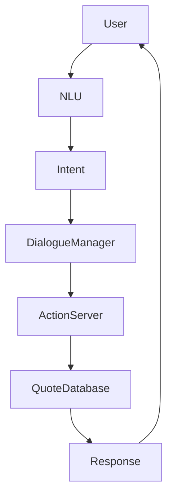
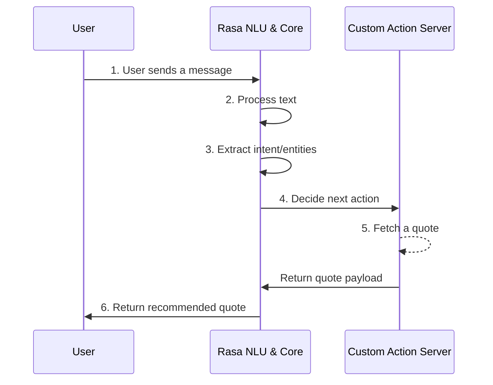

# 💬 Quotes Recommendation Chatbot (Rasa NLP)


## 📖 Project Overview

This project is an **AI-powered conversational chatbot** that recommends inspirational quotes based on user intent and conversation context. Built using the **Rasa conversational AI framework**, the bot seamlessly understands user inputs and delivers meaningful inspiration.

The chatbot uses state-of-the-art NLP techniques, including:
- **Natural Language Understanding (NLU)**
- **Intent classification**
- **Entity extraction**
- **Dialogue management**
- **Custom actions**
- **Quote recommendation logic**

**Use Cases:**
- 🌟 Motivational chatbot
- 🧘 Personal inspiration assistant
- 🤖 Conversational NLP demo project
- 🎓 Educational Rasa project

---

## ✨ Key Features

- 🧠 Conversational AI powered by **Rasa**
- 🗣️ Intent recognition using NLP
- 🔄 Context-aware dialogue management
- 💡 Dynamic quote recommendation
- ⚙️ Custom actions for quote retrieval
- 🧩 Modular Rasa architecture
- 📂 Extensible dataset for new quotes
- 🚀 Easily deployable chatbot server

---

## 🛠️ Tech Stack

| Component | Technology |
| :--- | :--- |
| **Language** | Python 🐍 |
| **Framework** | Rasa 🤖 |
| **NLP Components** | DIET Classifier, Entity Extractor, Intent Classification |
| **Backend** | Python Action Server ⚙️ |
| **Data Format** | YAML training data 📄 |
| **Tools** | Postman, VS Code, Git 🛠️ |

---

## 🏛️ System Architecture

The chatbot follows a standardized conversational AI pipeline, taking a user message, parsing intents and entities, and hitting an action server to dynamically fetch quotes.



---

## 🔄 Chatbot Workflow

The conversational flow operates sequentially to ensure highly accurate quote recommendations:

1. **User sends a message**: The user inputs a text request. 
2. **Rasa NLU processes the text**: The NLP pipeline tokenizes and featurizes the input.
3. **Intent and entities are extracted**: The model recognizes the user's need.
4. **Dialogue manager decides the next action**: Rasa Core predicts that a specific custom action needs to run.
5. **Custom action fetches a quote**: Python logic retrieves a relevant quote.
6. **Bot returns recommended quote**: The final message is displayed to the user.

### Workflow Diagram



---

## 📁 Project Structure

```text
quotes-recommendation-bot/
│
├── data/
│   ├── nlu.yml          # Contains NLU training data (intents & examples)
│   ├── stories.yml      # Defines training dialogue flows (stories)
│   └── rules.yml        # Strict conversational policies and rules
│
├── domain.yml           # The universe of the bot (intents, entities, slots, forms, actions)
├── config.yml           # Configuration for the NLU pipeline and Core policies
├── actions/
│   └── actions.py       # Custom Python code for quote recommendation logic
│
├── models/              # Saved Rasa models after training
├── endpoints.yml        # Configuration for external endpoints (like the action server)
├── credentials.yml      # Authentication for messaging channels
└── README.md            # Project documentation
```

---

## ⚙️ Rasa NLP Pipeline

The chatbot utilizes a comprehensive Rasa NLU pipeline for high-accuracy text processing:

- **`WhitespaceTokenizer`**: Splits the message into individual words based on whitespace.
- **`RegexFeaturizer`**: Extracts features based on predefined regular expressions.
- **`LexicalSyntacticFeaturizer`**: Analyzes the syntax and lexical properties of the text.
- **`CountVectorsFeaturizer`**: Creates bag-of-words representations of messages.
- **`DIETClassifier`**: A dual intent and entity transformer architecture structure for simultaneous intent classification and entity extraction.
- **`EntitySynonymMapper`**: Maps extracted entities to standardized synonym values.
- **`ResponseSelector`**: Manages and selects the most appropriate predefined response.

---

## 🎯 Quote Recommendation Logic

The bot implements an intelligent categorization mechanism to serve accurate recommendations.

**Flow:**
`User Intent` ➔ `Quote Category` ➔ `Retrieve Quote` ➔ `Send Response`

When an intent is detected, the custom action server maps the intent to a specific quote category:
- 🚀 **Motivation**
- 🏆 **Success**
- 🌱 **Life**
- 😊 **Happiness**
- 🦉 **Wisdom**

---

## 🚀 Installation Guide

### 1. Clone repository
```bash
git clone <repo-url>
cd quotes-recommendation-bot
```

### 2. Create virtual environment
```bash
python -m venv venv
source venv/bin/activate
```

### 3. Install dependencies
```bash
pip install rasa
```

### 4. Train model
```bash
rasa train
```

### 5. Run action server
Open a new terminal, activate the environment, and run:
```bash
rasa run actions
```

### 6. Run chatbot
In your main terminal, start the bot interface:
```bash
rasa shell
```

---

## 💬 Example Conversation

**User:**
> I need motivation

**Bot:**
> Here is a motivational quote for you:  
> *"The only way to achieve the impossible is to believe it is possible."*

---

## 🔮 Future Improvements

- 🧠 Transformer based embeddings
- 🖥️ Web UI interface
- 🎙️ Voice chatbot integration
- 📊 Recommendation ranking system
- 🎭 Sentiment-aware quote recommendation
- ☁️ Deployment on cloud (AWS / Docker)

---

## 🤝 Contribution Guide

Contributions are always welcome! How developers can contribute:

1. **Fork repository**
2. **Create feature branch** (`git checkout -b feature/AmazingFeature`)
3. **Commit changes** (`git commit -m 'Add some feature'`)
4. **Push branch** (`git push origin feature/AmazingFeature`)
5. **Create pull request**

---

## 📄 License

MIT License
